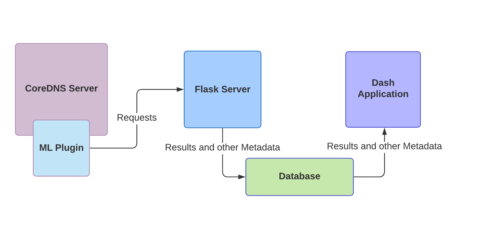
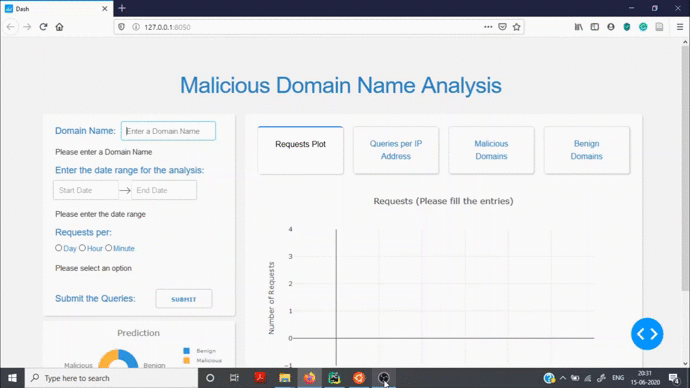

# CoreDNS Machine Learning Plugin

This CoreDNS plugin connects CoreDNS server to Machine Learning Environment for
DNS request and response analysis, monitoring and alerting. 

## Overview 

This plugin is the result of my work on a project during GSoC 2020. The goal of 
the project was introducing the integration of machine learning capabilities
into CoreDNS server functions.

The initial use case was the identification of the DNS requests for the records
of the domains that could be used by malicious hackers and other computer 
criminals. Upon the identification of the requests the plugin would either alert
the sysadmin or block the requests and responses.  

## Approach

### Application Middleware

Currently, Golang doesn't have native libraries for the interaction with the 
CUDA platform. At the same time, the Python ecosystem has tools like TensorFlow,
PyTorch, MXNet and various others that not only interact with the CUDA platform
but also allows for the easy prototyping and evaluation of deep learning models. 

This project combines the deep learning capabilities that the Python ecosystem
provides by creating a Python Middleware. The plugin intercepts a request 
and forwards it to Python middleware for further processing. 



The middleware is a Python Flask Server that receives the request along with 
other metadata. The Flask Server infers whether the request was malicious or 
benign via a pre-trained TensorFlow model and then stores the result along with
other metadata to a database.

The results and other metadata are visualized and analysed via a Dash
application. 

### Machine Learning

__Learning Dataset__

The deep-learning model is trained on a COVID-19 Cyber Threat Coalition 
Blacklist for malicious domains that can be found 
[here](https://blacklist.cyberthreatcoalition.org/vetted/domain.txt) and on a 
list of benign domains from DomCop that can be found 
[here](https://www.domcop.com/top-10-million-domains). 

Currently, the pre-trained model has been trained on the top 500 domain names 
from both these datasets. The final version of the pre-trained model will be 
trained on the entirety of both the datasets.  

__Learning Process__

Data Preprocessing: Each domain name is converted into a unicode code point 
representation and then extended to a numpy array of a length 256. The dataset 
was created by combining the malicious domains as well as the non-malicious. 
The dataset was split as follows:
- Train Set: 80% of the dataset.
- Validation Set: 10 % of the dataset
- Test Set: 10% of the dataset

Training: The deep-learning model is a Convolutional Neural Net that is 
trained using stochastic gradient descent with the Adam optimizer.

## Implementation

### Machine Learning Plugin and CoreDNS Build

The machine learning plugin is a CoreDNS plugin that forwards requests to the 
Flask Server via HTTP POST requests. Once the Flask server process the request,
it sends the prediction whether the domain name is malicious or benign back to 
the plugin. Depending on the nature of the domain name, the plugin can be 
configured to allow the request to fall through to the other plugins or send the
request to a honeypot or a blackhole.

To install and start CoreDNS please take a look at the CoreDNS 
[repository](https://github.com/coredns/coredns). To add external plugins, 
please take a look at the [example plugin](https://github.com/coredns/example).

To add the plugin to a particular port say 1053, please make the changes to the
Corefile as shown below:

```
.:1053 {
    mlplugin
}
```

### Application Middleware with Flask

The middleware is a Python Flask Server that contains the pre-trained 
Convolutional Neural Network. The Flask Server receives the domain name queried 
as well as the IP address of the machine used to query that particular domain as
a JSON message via HTTP POST requests from the plugin.  

Once the Flask Server receives the domain name and the IP address, the domain 
name is preprocessed and then passed to the pre-trained deep learning model. The
deep learning model then classifies whether the domain name is of a malicious 
website or not and then sends the same back to plugin as a JSON message.

The classification result as well as other metadata such as the IP address, the 
date and time of the request are stored in a NoSQL database, namely 
Elasticsearch, due to which storing and querying the classification result and 
the metadata is a fast process. 

Before running the Flask Server, it is recommended that the Elasticsearch server
is running in the background. To install Elasticsearch, please follow the 
instructions found on this 
[page](https://phoenixnap.com/kb/install-elasticsearch-ubuntu). Once 
Elasticsearch is installed, `cd` into it and enter `bin/elasticsearch` to run the 
Elasticsearch server. 
 
To run the Flask Server, `cd` into the `flask_server` directory and then enter
`python dns_monitoring_server.py` in the command line. 

### TensorFlow Model

#### Tensorflow Model Definition

The pre-trained deep learning model is a Convolutional Neural Net whose input is
a (16, 16, 1) shaped array and the output is a single value lying in between 0 
and 1. If the output value is less than 0.5 the domain name is considered benign
, else it is considered malicious. 

The model summary can be found below:


| Layer      | Output Shape          | Activation   | Number of Parameters |
|:----------:|:---------------------:|:------------:|:--------------------:|
| Input      | (None, 16, 16, 1 )    | -            |0                     |
| Conv2D     | (None, 15, 15, 16)    | Relu         |80                    |
| MaxPooling | (None, 7, 7, 16)      | -            |0                     |
| Conv2D     | (None, 6, 6, 16)      | Relu         |1040                  |
| MaxPooling | (None, 3, 3, 16)      | -            |0                     |
| Conv2D     | (None, 2, 2, 8 )      | Relu         |520                   |
| Flatten    | (None, 32)            | -            |0                     |
| Dense      | (None, 8 )            | Relu         |264                   |
| Dense      | (None, 1 )            | Sigmoid      |9                     |

#### TensorFlow Model Visualization

The model can be visualized as follows: 


#### Results

The accuracy for the Train Set, Validation Set and Test Set is as follows:

| Metric   | Train Set   | Validation Set | Test Set |  
|----------|-------------|----------------|----------|
| Accuracy | 99.25 %     | 98.00 %        | 98.00 %  |

For more information, the model training procedure as well as the saved model 
can be found in this 
[repository](https://github.com/Chanakya-Ekbote/dns_alert_model).

### Visualization Dashboard

To analyse and visualize the results stored in the in the Elasticsearch 
database, a Dash Application was created. A small demo of the application can be
seen below:



The application has three main uses:

- __Domain Name Analysis:__ The application allows the user to search for a
a particular domain name along with a time range. The application will then
search for that particular domain name in the Elasticsearch database. Once the 
domain name is found, the app will display the number of requests to that 
particular domain name, the nature of the domain name (benign or malicious) and
also the IP addresses that have queried that particular domain name. This allows
the user to have a domain specific analysis.

- __Analysis of Malicious Domain Names:__ The application allows the user to
visualize the top 20 malicious domains queried as a bar graph. It also displays 
a list of all the malicious domains queried which can be seen via a toggle
switch in the same window. This allows the user to gain a general picture of all
the malicious domain names queried and also helps in identifying model 
misclassification.

- __Analysis of Benign Domain Names Graph:__ The application allows the user to
visualize the top 20 benign domains queried as a bar graph. It also displays 
a list of all the benign domains queried which can be seen via a toggle
switch in the same window. This allows the user to gain a general picture of all
the benign domain names queried and also helps in identifying model 
misclassification.

To the run the Dash application `cd` into the `analysis_app` directory and then
use `python malicious_domain_name_analysis.py`. Please note that the 
Elasticsearch server has to run in the background.

### Testing Harness

As there are various components to the machine learning pipeline, each component
has its own testing harness. 

### CoreDNS Test Harness

To test whether CoreDNS works properly, make the following change to the 
Corefile:

```
.:1053 {
    whoami
}
```

Then 'cd' into the `coredns` directory and enter `./coredns` in the command line.

Open a new terminal and then enter `dig @127.0.0.1 -p 1053 www.example.com`. If a 
reply is recived CoreDNS is working properly.

### Elasticsearch Test Harness

To test whether Elasticsearch works properly, first run Elasticsearch by going 
into the Elasticsearch directory and then enter `bin/elasticsearch` in the 
command line. Next enter the following into the command line:

```
python
>>> from elasticsearch import Elasticsearch
>>> es = Elasticsearch()
>>> es.indices.get('*')
``` 

If Python doesn't throw any error and returns a JSON object, Elasticsearch is 
working well.

### Machine Learning Plugin and Flask Server Test Harness

To test whether the machine learning plugin as well as the Flask server works 
properly first run CoreDNS with the machine learning plugin at a particular 
port, run Elasticsearch and the Flask Server.

Next open a new terminal and enter `dig @127.0.0.1 - p port_number 
www.google.com`. Then open the terminal where the CoreDNS server is running and
check the output. If the output contains either `Benign Domain: [domain_name] |
Probability: [probability_value]` or `Malicous Domain: [domain_name] | 
Probability: [probability_value]` then both the machine learning plugin and the
Flask server are working well. 

### Dash Application Test Harness

The Dash application has an in built debugger that throws errors if anything
goes wrong. If there are no errors thrown by the debugger, the application is 
working well


  